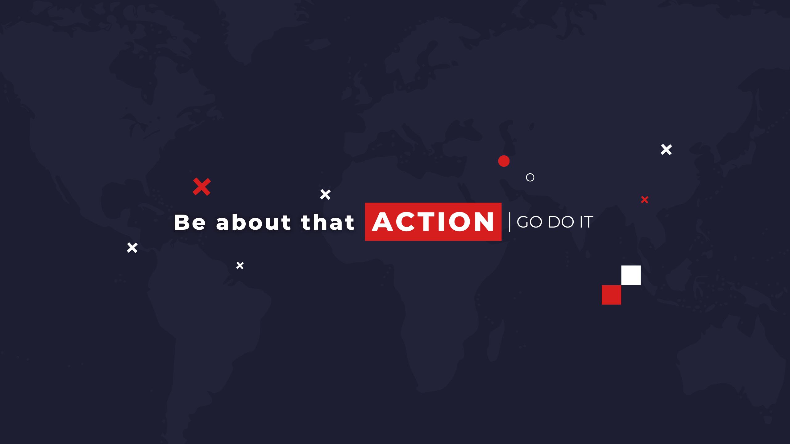
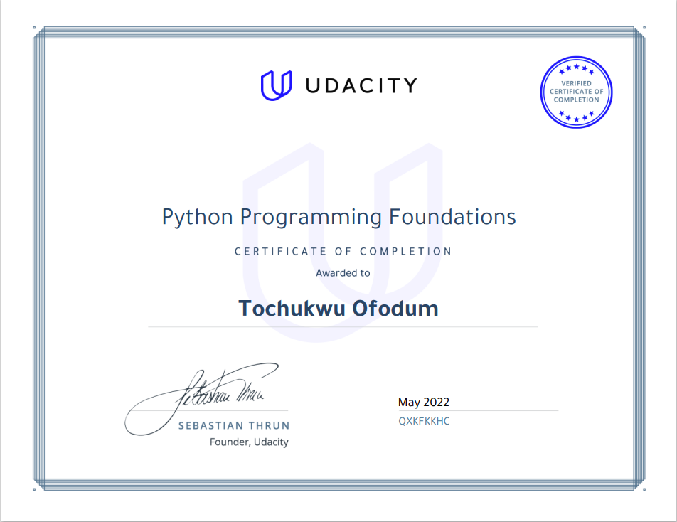

 
 
<h1 align='center'>About Me</h1>
As a physics graduate, I have always been passionate about solving problems. This passion led me to become a data scientist and I am now enthusiastic about building tools for businesses. Recently, while completing a course at Udacity in AI programming with Python, I developed a command-line application for classifying flower species using images. Working on this project enhanced my programming skills in Python and allowed me to gain a deep understanding of libraries like Numpy, Pandas, and Matplotlib, as well as a deeper understanding of neural networks.
 
 
To enhance my skills and take my career to the next level, I am currently immersing myself in the field of data science. I am taking the Google Data Analytics Coursera program, which has provided me with a comprehensive understanding of the fundamental concepts of data analysis and visualization tools such as SQL, Python, and Google Analytics. I am eager to apply this knowledge to real-world problems and continue to develop my programming skills in data science.
 
 
Below is my certification from AI programming with Python Nanodegree and Python Programming Foundations
 
 

 
 

>Be about that ACTION and Go Do It

  
