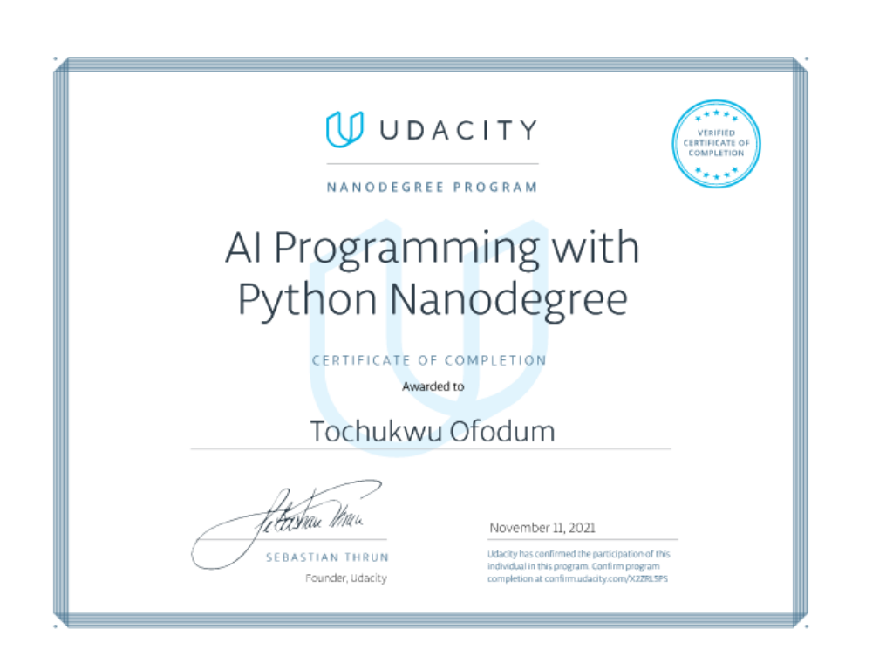

 
 
<h1 align='center'>About Me</h1>
Hi, I'm <b>Tochukwu</b>, a <b>Machine Learning Engineer</b> interested in developing tools that help businesses meet their customer needs. I enjoy the process of deeply understanding the user through user data, identifying problems, and solving it utilizing artificial intelligence. My recent project was building an Image classifier application at Udacity's AI programming with Python Nanodegree modifying PyTorch machine learning models to classify spices of flowers. My goal is to build tools and features that help businesses understand their customers.

Below is my certification from AI programming with Python Nanodegree

>From small things come great things

  
