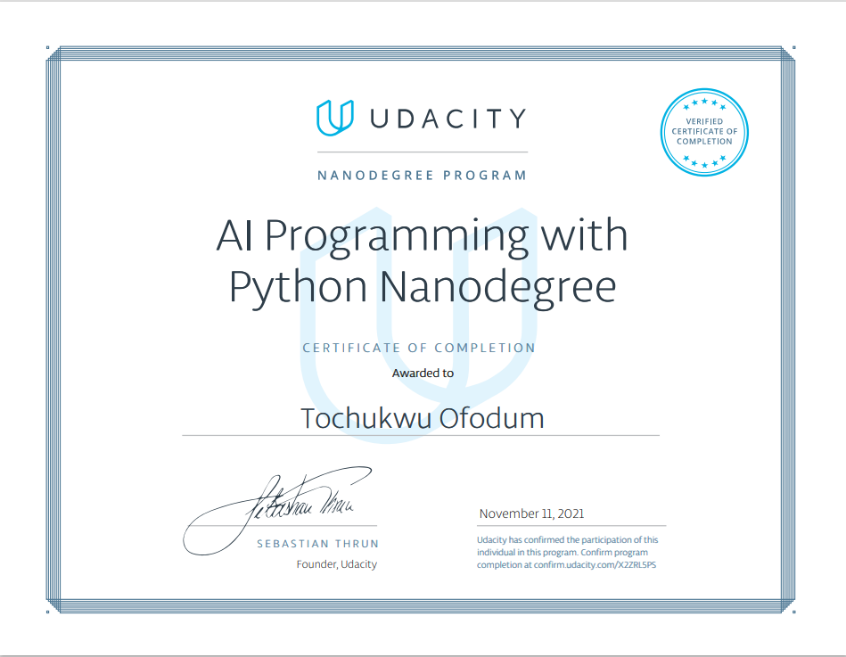
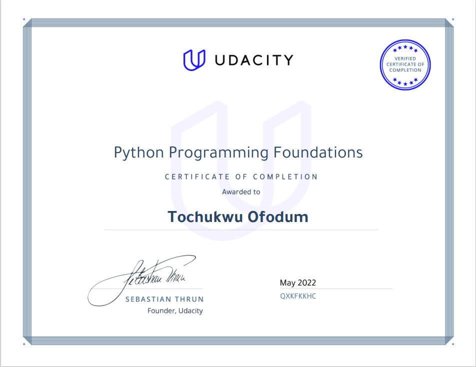

<h1 align="center">Hey there 👋, I'm Champraise!</h1>

💡 AI Engineer | 🧠 Machine Learning Learner | ⚡ Competitive Coder

---

🚀 **My Current Mission (The Next 6 Months)**
I'm dedicating this season to intensive **learning, hands-on practice, and competitive programming** to solidify my foundation in AI/ML. My goal is to rapidly expand my portfolio and readiness for entry-level/short-term roles.

---

🧠 **A Quick Snapshot of Me**

* 🎓 Graduate with a focus on **logic, puzzles, and problem-solving**—the perfect fuel for a career in AI.
* 🧑‍💻 Completed Udacity’s **AI Programming with Python** Nanodegree.
* 🌸 Built a command-line flower classifier using PyTorch, which was a deep dive into neural networks!
* 📚 Currently diving deep into the **Google Data Analytics** program on Coursera.
* 📈 Actively learning how to make data talk using **SQL**, **Python**, **Google Analytics**, and visualization tools.
* 🏆 **Focusing on competitive coding** (e.g., Kaggle, LeetCode) to sharpen algorithm and ML skills.
* 💬 Documenting my journey and building in public.

---

💼 **Seeking Opportunities: Short-Term AI/ML Projects**

I am actively looking for **contract, short-term, or portfolio-building roles** where I can apply my growing skills in Python, PyTorch, and data analysis.

**My Ideal Short-Term Roles Include:**

* **ML/AI Engineering:** Assisting with model training, testing, or basic deployment (e.g., using Flask/Streamlit).
* **Data Analysis:** Data cleaning, manipulation, and visualization using Pandas, SQL, and Matplotlib.
* **Data Preparation:** Annotation, labeling, and pipeline assistance.

**If you have a 1–3 month project or a defined task that needs execution, let’s talk! I am eager to contribute, deliver results, and increase my professional portfolio.**

---

📜 **Certifications**

  
  &nbsp;&nbsp;&nbsp;&nbsp;
  

---

📊 **GitHub Stats**

  
    
  

---

💡 **What I'm Cooking in 2025**

* 🔨 Building AI/data science tools in public, focusing on practical implementation.
* 🧪 **Competing consistently** in Kaggle and other data challenges.
* 📦 Launching **1–2 portfolio-defining projects** by year-end.
* ✍️ Sharing learnings, wins, and challenges along the way.

---

📫 **Let’s Connect**

If you're a fellow data geek, AI enthusiast, or have a **short-term project** that needs an eager pair of hands, let’s chat!
> *“Be about that ACTION and Go Do It”*

---

📌 **Tech & Tools I Love**

---

⚡ *Follow along as I document the journey—one repo and one competition at a time!*
