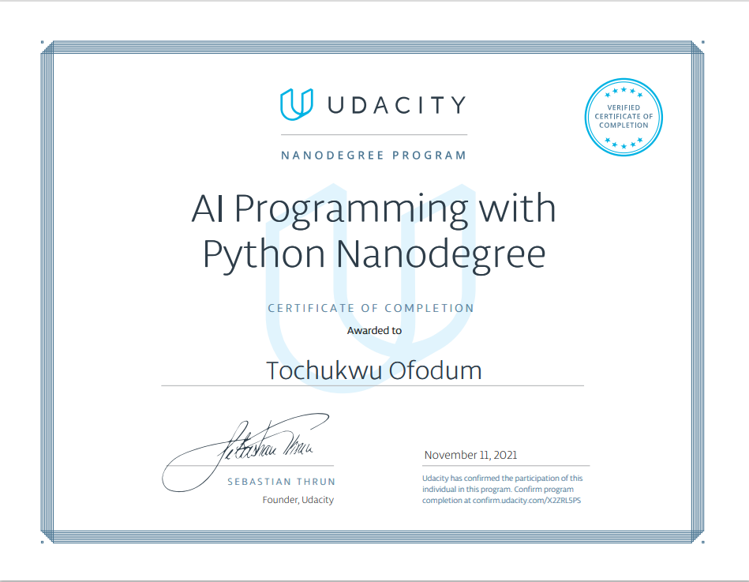

<h1 align="center">Hey there 👋, I'm Champraise!</h1>

🚀 Data Scientist | 🧠 AI Enthusiast | ⚛️ Physics Grad Turned Problem-Solver

---

🎯 **My Mission**  
From calculating quantum probabilities to decoding neural networks—I'm passionate about turning complex problems into AI-powered solutions for real-world businesses.

---

🧠 **A Quick Snapshot of Me**

- 🎓 Physics graduate with a love for logic, puzzles, and code.
- 🧑‍💻 Recently completed Udacity’s **AI Programming with Python** Nanodegree.
- 🌸 Built a command-line flower classifier using PyTorch that taught me a ton about neural nets!
- 📚 Currently diving deep into the **Google Data Analytics** program on Coursera.
- 📈 Learning how to make data talk using **SQL**, **Python**, **Google Analytics**, and visualization tools.
- 💬 Love sharing knowledge and documenting my progress in public.

---

📜 **Certifications**

  
    
  

---

📊 **GitHub Stats**

  
    
  

---

💡 **What I'm Cooking in 2025**

- 🔨 Building AI/data science tools in public
- 🧪 Experimenting with side projects (think visualizations, analytics dashboards, ML models!)
- 📦 Launching at least 1-2 GitHub projects by the end of the year
- ✍️ Sharing learnings, wins, and fails openly

---

📫 **Let’s Connect**

If you're a fellow data geek, AI enthusiast, or just curious about what I'm building, let’s chat!  
> *“Be about that ACTION and Go Do It”*

---

📌 **Tech & Tools I Love**

---

⚡ *Follow along as I document the journey—one repo at a time!*
